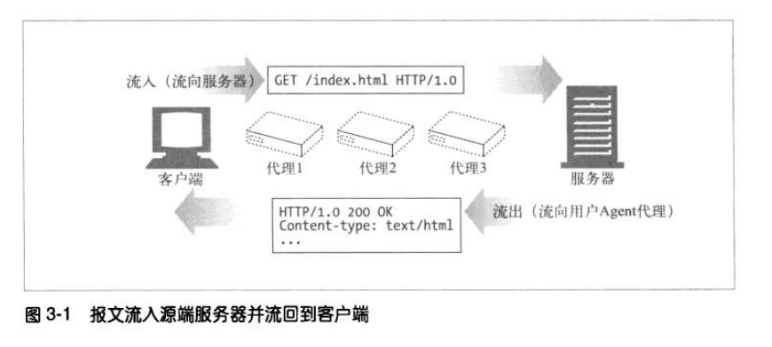
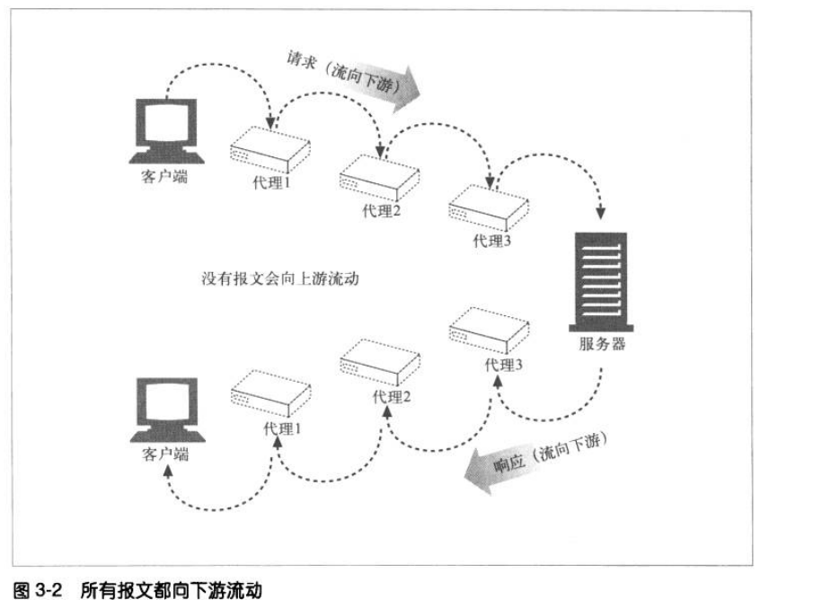
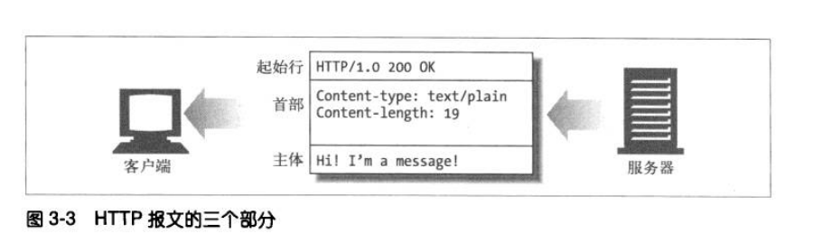
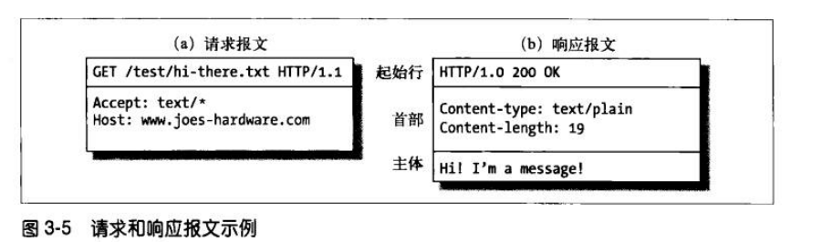

  如果说HTTP是因特网的信使,那么HTTP报文就是他用来搬东西的包裹.

## 3.1  报文流

  HTTP报文是在HTTP应用程序之间发送的数据库.这些数据块以一些文本的形式开头,描述了报文的内容及含义,后面跟着可选的数据部分.

### 3.1.1 报文流入源端服务器
  HTTP使用术语流入和流出来描述事务处理的方向.报文由客户端流入(流向)服务器,有服务器流出(流向)Agent代理 流向客户端.

  如下图
  

### 3.1.2 报文向下游流动

  HTTP报文会像河水一样流向,不管是请求报文或是响应报文,所有的报文都会想下游流动(参见下图).

  

## 3.2 报文的组成部分

* HTTP报文是简单的格式化数据块.
* 每条报文都包含一条来自客户端的请求,或者一条来自服务器的响应
* 由三部分组成: 对报文进行描述的起始行、包含属性的首部块、包含数据的主体部分


### 3.2.1 报文的语法
所有的HTTP报文都可以分为两类:请求报文(request message)和响应报文(response message).
*请求报文会像Web服务器请求一个动作.
*响应报文会将请求的结果返回给客户端.

请求报文格式:
```
<method> <request-URL> <versoin>  //起始行(请求行)
<headers>                         //包含属性的首部块
<blank line>                      //空行分割header和请求内容 
<entity-body>                     //包含数据的主体部分
```
响应报文的格式:
```
<version><status><reason-phrase> //起始行(相应行)
<headers>                        //包含属性的首部块
<blank line>                     //空行分割header和响应内容 
<entity-body>                    //包含数据的主体部分
```
请求报文跟响应报文的语法只有其是行有所不同.

*方法(method): 客户端希望服务器对资源执行的动作.

*请求URL(request-URL): 命名了所请求资源,或者URL路径组件的完整URL.

*版本: 版本所使用HTTP版本 

*状态吗: 三位数字,描述了请求过程中所发生的情况

*原因短语: 数字状态的可读版本,包含行终止序列之前的所有文本.

*首部: 可以有零个或多个首部,每个首部都是包含一个名字,后面跟着一个冒号(:),然后是一个可选的空格,接着是一个值,最后是一个CRLF.(请求头部由关键字/值对组成，每行一对)

*实体的主体部分: 实体的主体部分包含一个有任意数据组成的数据块,并不是所有的报文都包含实体的主体部分.



### 3.2.2 起始行

#### 1.请求行

请求报文的起始行,或称为请求行,包含了一个方法,一个请求URL和HTTP的版本.

    方法描述了服务器应该执行的操作.

    请求URL描述了资源的位置

    HTTP版本告知客户端使用的是那种HTTP

#### 2.响应行

响应报文的起始行,或称为响应行包含响应报文使用的HTTP版本、数字状态码、以及描述操作状态的文本形式的原因短语.

响应报文的起始行,承载了状态信息和操作所产生的所有数据.

    HTTP/1.0 200 ok 字段由空格符分隔

    http/1.0     HTTP版本
    200          数字状态码
    ok           原因短语

####  3.方法
请求的起始行以方法作为开始,方法用来告知服务器要做些什么.

1） GET

　　传递参数长度受限制，因为传递的参数是直接表示在地址栏中，而特定浏览器和服务器对url的长度是有限制的。

　　因此，GET不适合用来传递私密数据，也不适合拿来传递大量数据。

　　一般的HTTP请求大多都是GET。

2）POST

　　POST把传递的数据封装在HTTP请求数据中，以名称/值的形式出现，可以传输大量数据，对数据量没有限制，也不会显示在URL中。

　　表单的提交用的是POST。

3）HEAD

　　HEAD跟GET相似，不过服务端接收到HEAD请求时只返回响应头，不发送响应内容。所以，如果只需要查看某个页面的状态时，用HEAD更高效，因为省去了传输页面内容的时间。

4）DELETE

　　删除某一个资源。

5）OPTIONS

　　用于获取当前URL所支持的方法。若请求成功，会在HTTP头中包含一个名为“Allow”的头，值是所支持的方法，如“GET, POST”。

6）PUT

　　把一个资源存放在指定的位置上。

　　本质上来讲， PUT和POST极为相似，都是向服务器发送数据，但它们之间有一个重要区别，PUT通常指定了资源的存放位置，而POST则没有，POST的数据存放位置由服务器自己决定。

　　关于POST和PUT的区别以及请求方法的幂等性，请参考文章：http的7种请求方法和幂等性

7）TRACE

　　回显服务器收到的请求，主要用于测试或诊断。

8）CONNECT

　　CONNECT方法是HTTP/1.1协议预留的，能够将连接改为管道方式的代理服务器。通常用于SSL加密服务器的链接与非加密的HTTP代理服务器的通信。

####  4.状态码

状态码位于响应行的起始行中,用来告诉客户端发生了什么.

状态码分类

| 整体范围 | 已定义范围 | 分类       |
| -------- | ---------- | ---------- |
| 100~199  | 100~101    | 信息提示   |
| 200~299  | 200~206    | 成功       |
| 300~399  | 300~305    | 重定向     |
| 400~499  | 400~405    | 客户端错误 |
| 500~599  | 500~505    | 服务器错误 |

常见状态码

| 状态码 | 已定义范围           | 分类                                |
| ------ | -------------------- | ----------------------------------- |
| 200    | ok                   | 成功,请求的所有数据都在响应主体中   |
| 401    | Unauthorized(未授权) | 需要输入用户名和密码                |
| 404    | Not Found(未找到)    | 服务器无法找到所请求的URL对应的资源 |


#### 1xx：指示信息，表示请求已接收，继续处理
#### 2xx：成功，表示请求已被成功接受，处理。
    200 OK：客户端请求成功
    204 No Content：无内容。服务器成功处理，但未返回内容。一般用在只是客户端向服务器发送信息，而服务器不用向客户端返回什么信息的情况。不会刷新页面。
    206 Partial Content：服务器已经完成了部分GET请求（客户端进行了范围请求）。响应报文中包含Content-Range指定范围的实体内容
### 3xx：重定向
    301 Moved Permanently：永久重定向，表示请求的资源已经永久的搬到了其他位置。

    302 Found：临时重定向，表示请求的资源临时搬到了其他位置

    303 See Other：临时重定向，应使用GET定向获取请求资源。303功能与302一样，区别只是303明确客户端应该使用GET访问

    307 Temporary Redirect：临时重定向，和302有着相同含义。POST不会变成GET

    304 Not Modified：表示客户端发送附带条件的请求（GET方法请求报文中的IF…）时，条件不满足。返回304时，不包含任何响应主体。虽然304被划分在3XX，但和重定向没有关系
    一个304的使用场景：
    缓存服务器向服务器请求某一个资源的时候，服务器返回的响应报文具有这样的字段：Last-Modified:Wed,7 Sep 2011 09:23:24，缓存器会保存这个资源的同时，保存它的最后修改时间。
    
    下次用户向缓存器请求这个资源的时候，缓存器需要确定这个资源是新的，那么它会向原始服务器发送一个HTTP请求（GET方法），并在请求头部中包含了一个字段：If-Modified-Since:Wed,7 Sep 2011 09:23:24，这个值就是上次服务器发送的响应报文中的最后修改时间。

    假设这个资源没有被修改，那么服务器返回一个响应报文：

    HTTP/1.1 304 Not Modified
        Date：Sat, 15 Oct 2011 15:39:29
        (空行)                                      
        (空响应体)
    用304告诉缓存器资源没有被修改，并且响应体是空的，不会浪费带宽。

#### 4xx：客户端错误
    400 Bad Request：客户端请求有语法错误，服务器无法理解。
    401 Unauthorized：请求未经授权，这个状态代码必须和WWW-Authenticate报头域一起使用。
    403 Forbidden：服务器收到请求，但是拒绝提供服务
    404 Not Found：请求资源不存在。比如，输入了错误的url
    415 Unsupported media type：不支持的媒体类型
#### 5xx：服务器端错误，服务器未能实现合法的请求。
    500 Internal Server Error：服务器发生不可预期的错误。
    503 Server Unavailable：服务器当前不能处理客户端的请求，一段时间后可能恢复正常，

#### 5.原因短语  为状态码提供了文本形式的解释

#### 6.版本号 为使用HTTP的应该程序提供一种线索,以便互相了解对方的能力和报文格式

### 3.2.3 首部

HTTP首部字段想请求和响应报文中添加了一些附加信息.

请求头部由关键字/值对组成，每行一对 

首部分类

通用首部: 既可以出现在请求报文中,也可以出现在响应报文中
请求首部: 提供更多有关请求的信息
响应首部: 听够更多有关响应的信息
实体首部: 描述主体的长度和内容,或者资源自身
扩展首部: 规范中没有定义的信首部

首部实例

| 首部实例                                 | 描述                                    |
| ---------------------------------------- | --------------------------------------- |
| Date:Tue, 30ct 1997 02:06:03 GMT         | 服务器产生响应的日期                    |
| Content-length:15040                     | 实体的主体部分包含了15040个字节的数据   |
| Content-type:image/gif                   | 实体的主体部分是一个GIF图片             |
| Accept: image/gif, image/jepg, text/html | 客户端可以接受GIF图片和JPEG图片以及HTML |

### 3.2.4 实体部分

HTTP报文的实体部分是可选的.实体部分是HTTP报文的负荷,就是HTTP要传输的内容.
HTTP报文可以承载很多类型的数字数据: 图片,视频,HTML文档,软件应用程序等等.