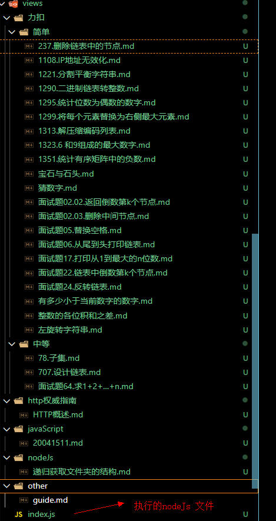

## 递归获取文件夹的结构

## 例子
目录结构



结果

```
[
  {
    "dirName": "http权威指南",
    "children": [
      "HTTP概述.md"
    ]
  },
  "index.js",
  {
    "dirName": "javaScript",
    "children": [
      "20041511.md"
    ]
  },
  {
    "dirName": "nodeJs",
    "children": [
      {
        "dirName": "image",
        "children": [
          "61cb48cb961adc057c4b6ba08fee949.png"
        ]
      },
      "递归获取文件夹的结构.md"
    ]
  },
  {
    "dirName": "other",
    "children": [
      "guide.md"
    ]
  },
  {
    "dirName": "力扣",
    "children": [
      {
        "dirName": "中等",
        "children": [
          "707.设计链表.md",
          "78.子集.md",
          "面试题64.求1+2+…+n.md"
        ]
      },
      {
        "dirName": "简单",
        "children": [
          "1108.IP地址无效化.md",
          "1221.分割平衡字符串.md",
          "1290.二进制链表转整数.md",
          "1295.统计位数为偶数的数字.md",
          "1299.将每个元素替换为右侧最大元素.md",
          "1313.解压缩编码列表.md",
          "1323.6 和9组成的最大数字.md",
          "1351.统计有序矩阵中的负数.md",
          "237.删除链表中的节点.md",
          "宝石与石头.md",
          "左旋转字符串.md",
          "整数的各位积和之差.md",
          "有多少小于当前数字的数字.md",
          "猜数字.md",
          "面试题02.02.返回倒数第k个节点.md",
          "面试题02.03.删除中间节点.md",
          "面试题05.替换空格.md",
          "面试题06.从尾到头打印链表.md",
          "面试题17.打印从1到最大的n位数.md",
          "面试题22.链表中倒数第k个节点.md",
          "面试题24.反转链表.md"
        ]
      }
    ]
  }
]
```
## 方法
```
var fs = require('fs')
var path = require('path')

function readdir(dirname, name) {
  var arr = []
  var readDir = fs.readdirSync(dirname)
  readDir.forEach(fileName => {
    var result = fs.statSync(path.resolve(dirname, fileName))
    if (result.isDirectory()) {
      var obj = Object.create(null)
      obj.dirName = fileName
      obj.children = readdir(path.resolve(dirname, fileName))
      arr.push(obj)
    } else {
      arr.push(fileName)
    }
  })
  return arr
}
var result = readdir(__dirname)
console.log(JSON.stringify(result, null, 2)) //打印结果
```